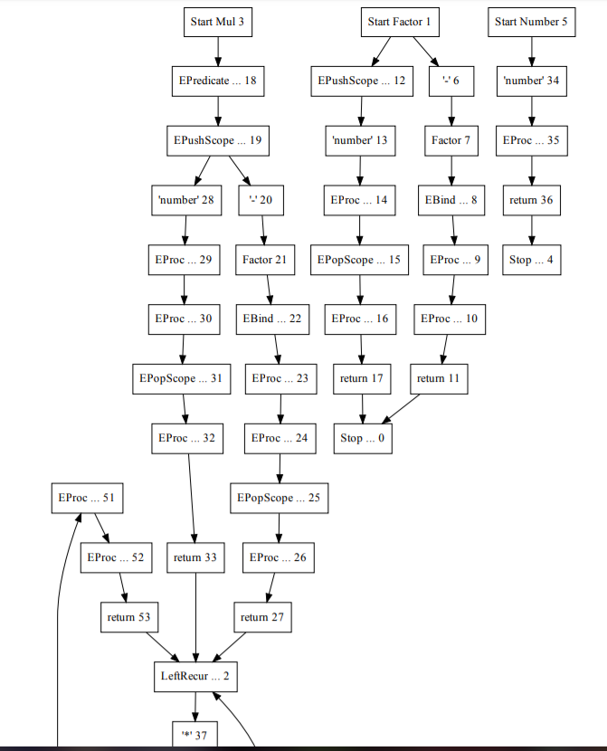

# RBNF

This README is going to get updated by Aug 15.

## Usage

```
Usage: [-v] [-h] [-in filename] [-out filename]
[-be python|ocaml|marisa(default)]
[-k lookahead number] [--trace : codegen with tracebacks.]
[--noinline : might be useful when viewing generated code]


# gen python
RBNF -in <infile>.rbnf -k <lookahead number> -out <outfile> -be python [--codegen-with-trace] --noinline

# gen ocaml
RBNF -in <infile>.rbnf -k <lookahead number> -out <outfile> -be ocaml [--codegen-with-trace] --noinline

```

## Repo Structure

- RBNF.IRs: a bunch of IRs useful for generating codes for various backend
    - Cirno: not for codegen, used before generating parsing graphs, to analyse parsing semantics.

        It will be simply interpreted in a stack-based virtual machine(a simple abstract interpreter).

    - Marisa: the first layer which is generated from the parsing graphs and user settings.

        It lacks of declarations, and is untyped, however sufficient for dynamic languages to
        do codegen.

    - Reimu:

        Typed by an extended HM type inferencer, resolved to have declarations(`let` bindings).

- RBNF.BackEnds
    - Merlin: code generator targeting OCaml back end, internally     extending `Reimu` IRs to
              resolve a lot of information useful for generating OCaml codes.
    - Pyrrha: code generator targeting Python back end

- to be continue

## Example

```
Number -> number
Factor -> Number | '-' a=Factor
Mul    -> ?always_true Factor
        | Mul '*' Factor
```

You can configure the generator to specify whether to generate
codes with error reports. The following code has no
support for error reporting.

## Note: Front End

### .rbnf

- `<a>`: non-terminal rule `a`
- `a/"a"`: terminal rule `a/quote a`
- `a | b`: `a` or `b`
- `a b c`: a sequence of parsing symbols
- `name=rule`: context-xsensitive feature, locally bind what produced by `rule` to `name`.
- `?f(x)/?f/?(f(g(x))`: use locally-binded variables to do some predictions.

- `a ::= b;`: classic production definition
- `a ::= b -> f;`: specify custom reduction rule

```
exp ::= "if" cond=<exp> "then"
            t=<exp>
        "else" f=<exp>
        -> If(cond, t, f);
exp ::= ...
```

P.S: comments not supported yet.

### eDSL in Haskell

```haskell
infix 5
infix 6 |=

number = "number"
negation = "-"
multiply = "*"

a |= b = CBind a b

a b = (a, b, Nothing)
case' a = CTerm (Case a)
parsers = S.fromList [
    "Number"   --> case' number
    , "Factor" --> CAlt [
            CNonTerm "Number",
            CSeq [case' negation, "a" |= CNonTerm "Factor" ]
        ]
    , "Mul"    --> CAlt [
            CSeq [ CPred (MTerm "always_true"), CNonTerm "Factor" ],
            CSeq [ CNonTerm "Mul", case' multiply, CNonTerm "Factor"]
        ]
    ]
```

Its equivalent notation of BNF derivative is

```
Number -> number
Factor -> Number | '-' a=Factor
Mul    -> ?always_true Factor
        | Mul '*' Factor
```

## Note: Left Recursion Handling




# Note: Lookahead decision trees(by ID3 algorithm)

```
======== Node1 ========
  LAShift (Case "-")
      LAShift (Case "-")
          LAShift (Case "-")
              [6]
          LAShift (Case "number")
              [6]
      LAShift (Case "number")
          [6]
  LAShift (Case "number")
      [12]
--- LA optimization:
case elts[0]
      LAShift (Case "-") => [6]
      LAShift (Case "number") => [12]

======== Node19 ========
  LAShift (Case "-")
      LAShift (Case "-")
          LAShift (Case "-")
              [20]
          LAShift (Case "number")
              [20]
      LAShift (Case "number")
          LAShift (Case "*")
              [20]
  LAShift (Case "number")
      LAShift (Case "*")
          LAShift (Case "-")
              [28]
          LAShift (Case "number")
              [28]
--- LA optimization:
case elts[1]
      LAShift (Case "*") => [28]
      LAShift (Case "-") => [20]
      LAShift (Case "number") => [20]

======== Node38 ========
  LAShift (Case "-")
      LAShift (Case "-")
          LAShift (Case "-")
              [39]
          LAShift (Case "number")
              [39]
      LAShift (Case "number")
          LAShift (Case "*")
              [39]
  LAShift (Case "number")
      LAShift (Case "*")
          [48]
--- LA optimization:
case elts[1]
      LAShift (Case "*") => [48]
      LAShift (Case "-") => [39]
      LAShift (Case "number") => [39]
```


## Note: Type Inference and Code Generation

The type inference is based on HM unification and propositioinal logics(logic formulas in disjunctive normal form).

## Note: Mutable Variable Resolutions

Check `RBNF.BackEnds.Merlin (resolve*)`.

## Back Ends

### Python Example:

```python
def lr_loop_Mul(_slot_0, prim__state, prim__tokens):
    lr_Mul_reduce = _slot_0
    lcl_0 = prim__tokens.offset
    _off_0 = lcl_0
    lcl_0 = lr_step_Mul(lr_Mul_reduce, prim__state, prim__tokens)
    lr_Mul_try = lcl_0
    lcl_0 = prim__is__null(lr_Mul_try)
    while lcl_0:
        lcl_0 = prim__tokens.offset
        _off_0 = lcl_0
        lr_Mul_reduce = lr_Mul_try
        lcl_0 = lr_step_Mul(lr_Mul_reduce, prim__state, prim__tokens)
        lr_Mul_try = lcl_0
    lcl_0 = prim__reset(prim__tokens, _off_0)
    return lr_Mul_reduce
def lr_step_Mul(_slot_0, prim__state, prim__tokens):
    lcl_0 = prim__tokens.offset
    _off_0 = lcl_0
    lcl_0 = prim__tk__id("*")
    lcl_0 = prim__match__tk(prim__tokens, lcl_0)
    _slot_1 = lcl_0
    lcl_0 = prim__is__null(_slot_1)
    if lcl_0:
        lcl_0 = prim__null
    else:
        _tmp_1_flag = False
        lcl_1 = prim__tokens.offset
        _off_1 = lcl_1
    ...
```

### OCaml Example:

```ocaml
module GeneratedParser (
    LexerInfo: sig val prim_token_names : (string, int) Hashtbl.t end
) = struct
let (* * *)token_id_of_42 : int Hashtbl.find LexerInfo.prim_token_names "*"
let (* - *)token_id_of_45 : int Hashtbl.find LexerInfo.prim_token_names "-"
let (* number *)token_id_of_110_117_109_98_101_114 : int Hashtbl.find LexerInfo.prim_token_names "number"
let rec lr_step_Mul : ((ast * state) * tokens) -> ast =
fun (_slot_0, prim__state, prim__tokens) ->
  ...
and lr_loop_Mul : ((ast * state) * tokens) -> ast =
fun (_slot_0, prim__state, prim__tokens) ->
  begin
    let lr_Mul_reduce : (ast) ref =
        ref _slot_0
    in
    let _off_0 : (int) ref =
        ref prim__tokens .offset
    in
    let lr_Mul_try : (ast) ref =
        ref (lr_step_Mul (!lr_Mul_reduce prim__state prim__tokens))
    in
    while prim__is__null (!lr_Mul_try)
      begin
        _off_0  :=  prim__tokens .offset ;
        lr_Mul_reduce  :=  !lr_Mul_try ;
        lr_Mul_try  :=  lr_step_Mul (!lr_Mul_reduce prim__state prim__tokens) ;
        end
    done ;
    prim__reset (prim__tokens !_off_0) ;
    !lr_Mul_reduce ;
    end
and parse_Factor : (state * tokens) -> ast =
fun (prim__state, prim__tokens) ->
    ...
and parse_Mul : (state * tokens) -> ast =
fun (prim__state, prim__tokens) ->
    ...
and parse_Number : (state * tokens) -> ast =
fun (prim__state, prim__tokens) ->
  ...
end
```